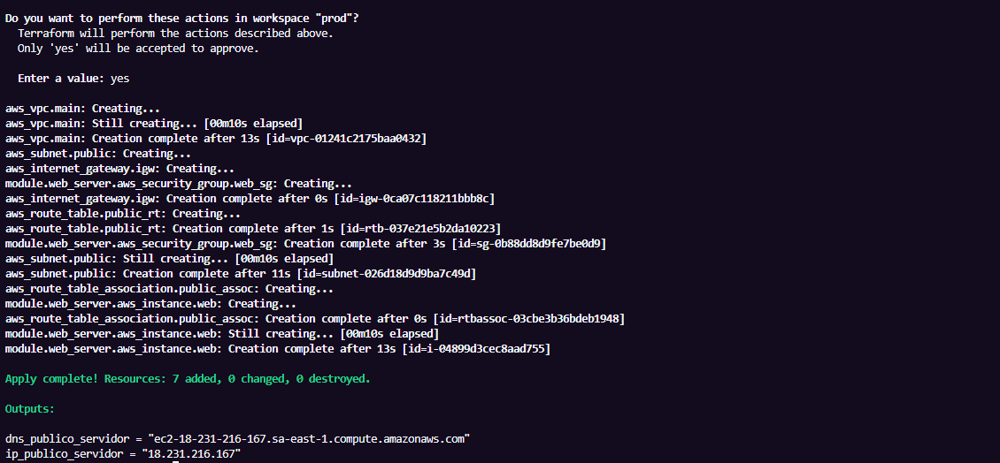
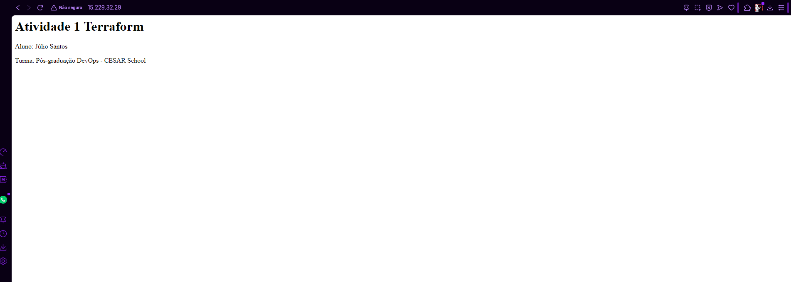
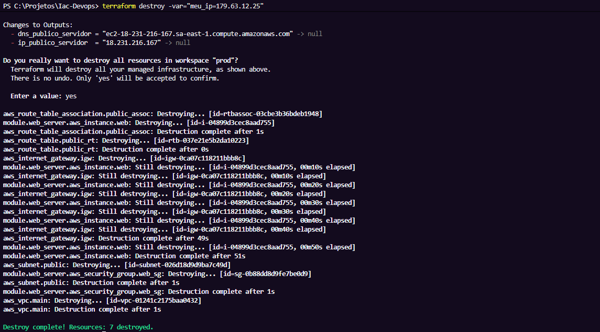
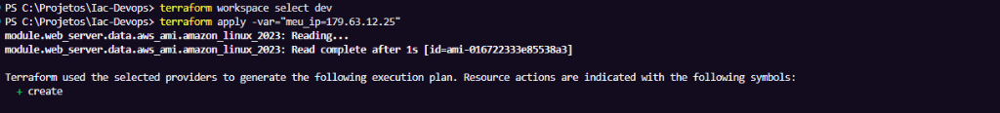
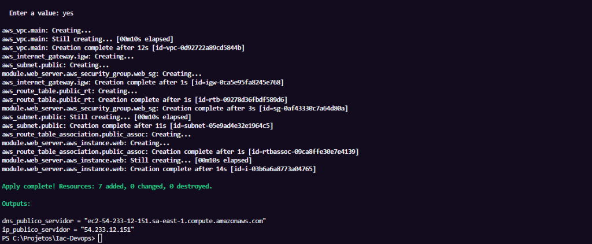
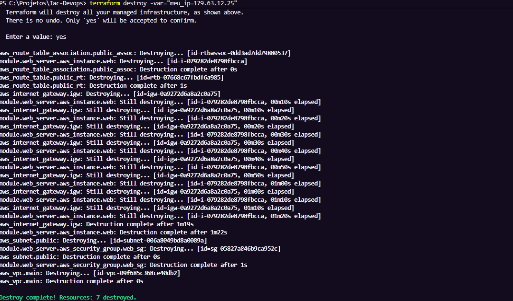

# Atividade 1 - Provisionamento de Infraestrutura Web na AWS com Terraform

Este projeto contém o código Terraform para provisionar a infraestrutura mínima na AWS para hospedar uma página web simples, cumprindo os requisitos da Atividade 1.
**Aluno:** Júlio Rodrigues de Aguiar Santos  
**E-mail:** jras2@cesar.school

## Pré-requisitos
- [Terraform](https://developer.hashicorp.com/terraform/downloads) instalado
- AWS CLI instalado e credenciais configuradas localmente (`aws configure`)
- Bucket S3 criado na AWS para armazenar o arquivo de estado (`tfstate`) remoto.

## Configuração do Backend
O projeto utiliza um backend remoto no S3. O bucket utilizado para armazenar o estado foi:
**terraform-state-cesar-julio-2026** 

## Variáveis
Você precisará fornecer o seu IP público para a regra de liberação da porta SSH (22) no Security Group. A variável se chama `meu_ip` e não possui um valor padrão.
As demais variáveis configuradas no `variables.tf` são opcionais de modificar, pois possuem valores default:
- `aws_region`: sa-east-1
- `vpc_cidr`: 10.0.0.0/16

## Como rodar o projeto

1. Inicialize o Terraform para baixar os plugins e configurar o backend S3:
   ```bash
   terraform init
   ```
2. Crie ou selecione os workspaces (`dev` ou `prod`):
   ```bash
   terraform workspace select prod || terraform workspace new prod
   terraform workspace select dev || terraform workspace new dev
   ```
3. Formate e valide o código (Boas práticas):
   ```bash
   terraform fmt -check
   terraform validate
   ```
4. Aplique a infraestrutura no workspace desejado, passando o seu IP público para a variável `meu_ip` (descubra seu IP [aqui](https://meuip.com.br/)):
   ```bash
   terraform apply -var="meu_ip=SEU_IP_AQUI"
   ```
5. Após os testes, destrua a infraestrutura para evitar custos indesejados:
   ```bash
   terraform destroy -var="meu_ip=SEU_IP_AQUI"
   ```

## Workspaces Utilizados e Evidências
A infraestrutura foi provisionada e testada nos workspaces `dev` e `prod`. Seguem as evidências de execução exigidas na atividade.

### Workspace: Prod
- **Apply Executado com Sucesso:**
  

- **Página Web Funcionando:**
  

- **Destroy Executado com Sucesso:**
  

### Workspace: Dev
- **Apply Executado com Sucesso:**
  
  

- **Destroy Executado com Sucesso:**
  
